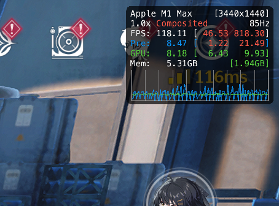
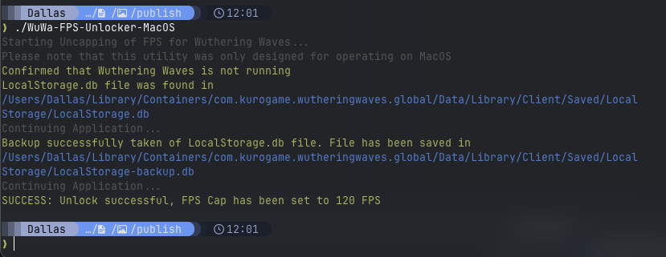
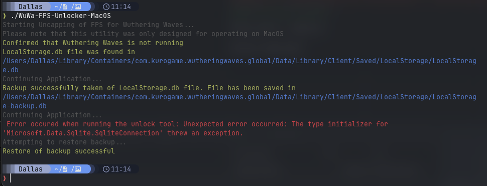

# FPS Cap unlocker for Wutheirng Waves on MacOS

Wuthering Waves officially only supports 120 FPS on M3 Pro/Max/Ultra, M4/M4 Pro/Max and only supports up to 60 FPS for M1/M2 series. This application allows you to increase the game's FPS cap to 120 from 60 for M1/M2 series Macs.

It works by altering the LocalStorage game configuration file to set the appropriate key value pairs to a value that will force 120 FPS as the frame cap

This is a rewrite of [MacOs-WuWa-fps-unlocker](https://github.com/Peekaey/MacOs-WuWa-fps-unlocker) but in F# with the aim to learn a bit about functional programming and some improvements such as auto backup of users LocalStorage.db file as well as auto restore in the event of a failure

## Instructions



### Operation
Success

 
 Fail
 


### Misc
- Running (Ensure that you are in the project folder).  ```dotnet run ```

- Building for release. 
```dotnet publish -c Release```

## Notes
Please note that the Microsoft.Data.Sqlite client requires "libe_sqlite3.dylib" alongside the application to run correctly.   
Therefore please don't attempt to run the application outside the publish folder to ensure that it works correctly

Application may also not work correctly immediately after a new release due to any changes to how refresh rate is set in game, in this case please open an issue to get this corrected

#### Credits
https://www.reddit.com/r/WutheringWaves/comments/1jm9c00/unlock_120_fps_in_version_22_new_db_method/.  
https://www.reddit.com/r/WutheringWaves/comments/1jls17i/120_fps_unlock_semipermanent_fix_for_22/.  
<b> Other similar programs for Windows </b>.  
https://github.com/WakuWakuPadoru/WuWa_Simple_FPSUnlocker
https://github.com/wakeupaj/wuwafpsunlocker